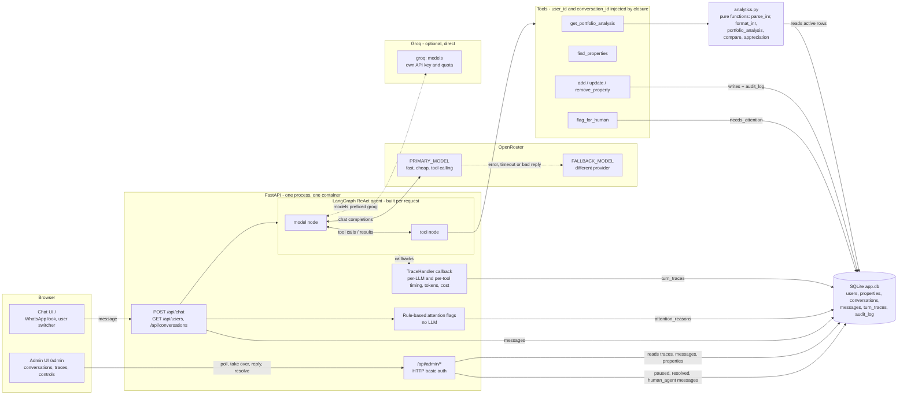

# Architecture

## Request lifecycle
A message from the chat UI hits `POST /api/chat {user_id, message}`. The API stores it, and if a human has taken the conversation over (`agent_paused`) it stops there — no agent reply. Otherwise it loads the last 20 messages as history and builds the tools for this request, closing over `user_id` and `conversation_id` so the model can neither see nor set them. A LangGraph ReAct agent (a static system prompt first, so the prefix is cacheable) calls OpenRouter with the tool schemas; the model chain is the primary wrapped in `with_fallbacks`, so a provider error, timeout, truncated reply or leaked chain-of-thought (a reply guard rejects those) retries once and then falls to the next model in the chain, which can be on a different provider (OpenRouter, or Groq directly for `groq:` models). For a typical question the model makes one call to `get_portfolio_analysis`; the tool reads the user's active rows from SQLite, runs the deterministic functions in `analytics.py`, and returns compact JSON containing raw numbers next to pre-formatted ₹ strings (plus scenario deltas and candidate insights). The model then writes a short WhatsApp-style reply from that output (2 LLM calls in total). Scenario arguments are computed in memory and never written; writes (`add`/`update`/`remove`) go through `db.py`, which records an `audit_log` row per changed field. A callback handler records every LLM call (model, latency, tokens, OpenRouter-reported cost) and tool call (args, result summary, latency, error) as the graph runs. After the turn the API stores the assistant message, writes the `turn_traces` row, computes rule-based attention flags (human hand-off requested, tool error, fallback used, >10 s, large value change, frustration keywords) and merges them into the conversation. The admin UI polls the same tables: it shows the transcript with a collapsible trace under each assistant message, and lets a team member mark resolved, take over (pause the agent), hand back, or reply as `human_agent`, which the chat UI shows in a differently coloured bubble on its next poll.
